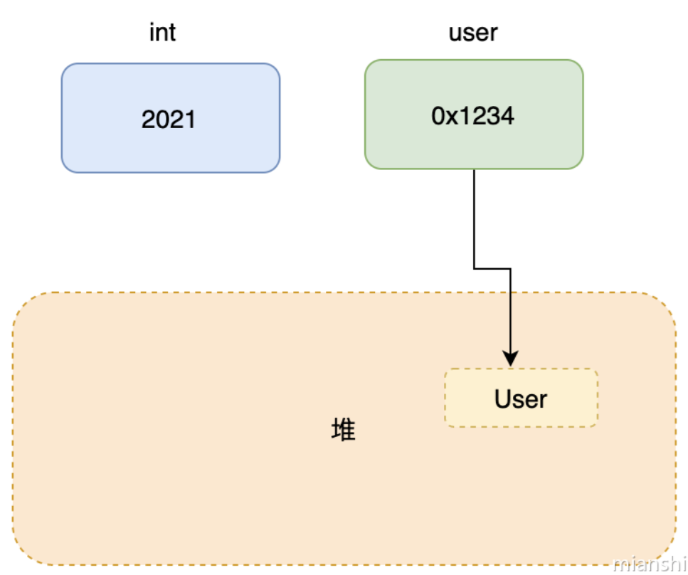
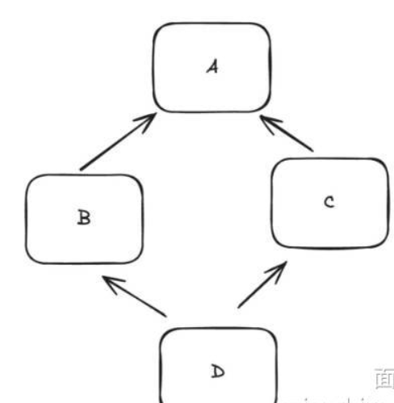
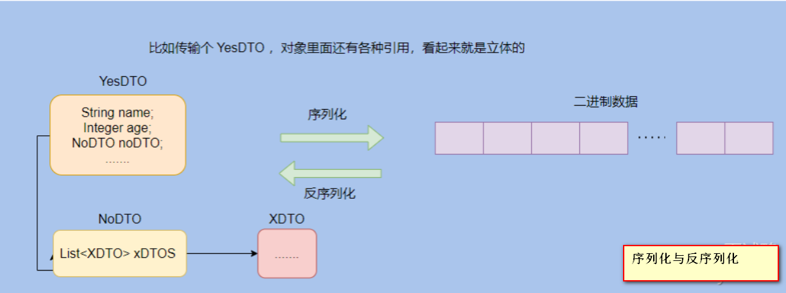
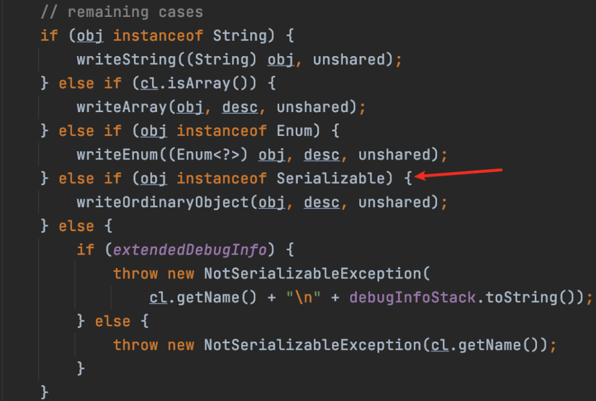
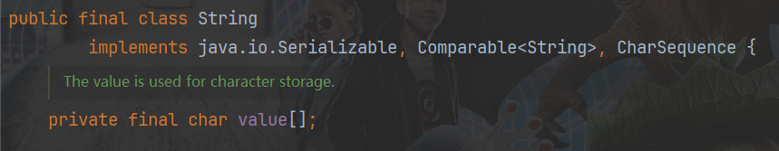
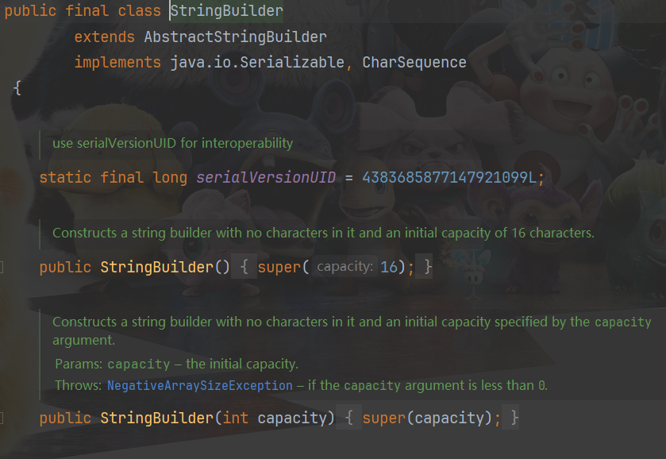
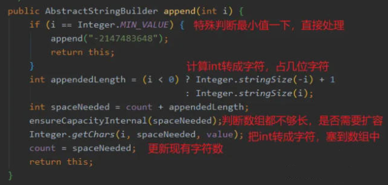
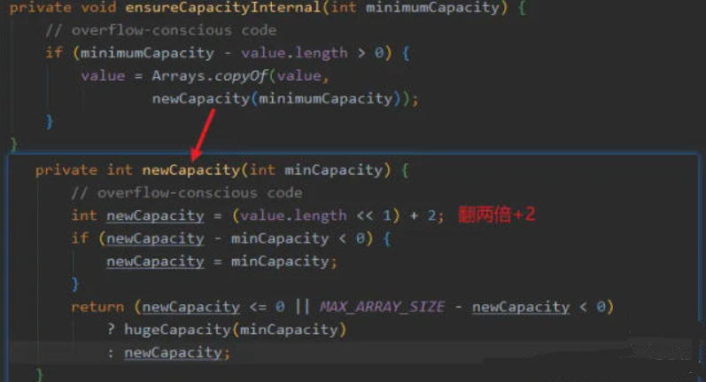

## 1.你认为java的优势是什么？
这种笼统的问题如果对某些知识点没有深入、系统的认识绝对会懵！
所以为什么经常碰到面试官问你一些空、大的问题？其实就是**考察你是否有形成体系的理解**
回到问题本身。我觉得可以从**跨平台、垃圾回收、生态**三个方面来阐述

### 跨平台
首先Java是跨平台的，不同平台执行的机器码是不一样的，而java因为中间加了一层JVM，所以可以做到一次编写多平台运行，即[Write once, Run anyWhere]
编译执行过程是先把java源码编译成字节码，字节码再由JVM解释执行或JIT编译执行，而因为JIT编译执行需要预热，所以还提供了AOT(Ahead-of-Time Compilation),
可以直接把字节码转换成机器码，来让程序重启之后迅速拉满战斗。

### 垃圾回收
java还提供垃圾自动回收功能，虽说手动管理内存意味着自由、精细化地掌控，但是很容易出错。
在内存系统较充裕的当下，将内存管理交给GC来做，减轻了编程负担，提升了开发效率

### 生态
Java的生态圈太全了，有非常丰富的第三方类库、网上全面的资料、企业级框架、各种中间件等等，总有一款适合你的业务需求

## 2.什么是Java的多态性？

### 回答重点
多态是指同一个接口或父类引用变量可以指向不同的对象实例，并根据实例指向的对象类型执行相应的方法。
它允许同一个方法在不同的对象上表现出不同的行为，面试对象编程的核心特性之一
#### 多态的优点：
* 通过多态，程序可以灵活的处理不同类型的对象，降低代码耦合度，增强系统的可扩展性。新增自子类或实现类时，无需修改原有点代码，只需通过接口或父类的引用
调用即可
### 扩展知识
#### 多态的意义
多态其实是一种抽象行为，它的主要作用是让程序员可以面对抽象编程而不是具体的实现类，这样写出来的代码扩展性会更强。
大家可能不理解什么是抽象什么是具体，举个例子
```java
class Person {
    void work() {
        System.out.println("工作");
    }
}

class Student extends Person {
    @Override
    void work() {
        System.out.println("上学");
    }
}

public class Test {
    public static void main(String[] args) {
        Person person = new Student();
        person.work(); // 输出 "上学"
    }
}
```
这样在使用的时候，对象都是person，但是new不同的实现类，表现的形式不同

#### 编译事多态和运行时多态
编译事多态和运行时多态是面向对象编程中多态性的两种实现方式，他们分别在不同的阶段决定方法的绑定。
* 编译时多态：通过方法重载实现，在编译时确定方法的调用
* 运行时多态：通过方法重写实现，在运行时确定方法的调用
##### 1.编译时多态
**编译时多态**：也称为**静态多态**，是在编译阶段确定方法的调用。编译时多态主要通过**方法重载**实现
**方法重载**：指在同一个类中定义多个方法，这些方法的名称相同但是参数列表不同（参数的类型和数量），
java编译器在编译时会根据方法调用时传入的参数类型和数量，来决定调用哪一个重载方法。
**示例**
```java
class Example {
    void display(int a) {
        System.out.println("Integer: " + a);
    }

    void display(double a) {
        System.out.println("Double: " + a);
    }

    void display(String a) {
        System.out.println("String: " + a);
    }
}

public class Main {
    public static void main(String[] args) {
        Example obj = new Example();
        obj.display(5);         // 调用 display(int a)
        obj.display(3.14);      // 调用 display(double a)
        obj.display("Hello");   // 调用 display(String a)
    }
}
```
例子中，编译器会根据方法传入的参数类型，决定调用哪个display方法

##### 2.运行时多态
**运行时多态**，也称为**动态多态**，是在运行时确定的方法调用。运行时多态通过**方法重写**实现。
**方法重写**：子类重写父类的一个或多个方法。通过父类引用调用方法时，实际执行的是子类重写后的方法，
这种多态性是在实际运行时根据实际的对象类型决定的。
**示例**
```java
class Animal {
    void sound() {
        System.out.println("Animal makes a sound");
    }
}

class Dog extends Animal {
    @Override
    void sound() {
        System.out.println("Dog barks");
    }
}

class Cat extends Animal {
    @Override
    void sound() {
        System.out.println("Cat meows");
    }
}

public class Main {
    public static void main(String[] args) {
        Animal myDog = new Dog(); // Animal reference but Dog object
        Animal myCat = new Cat(); // Animal reference but Cat object

        myDog.sound(); // 输出: Dog barks
        myCat.sound(); // 输出: Cat meows
    }
}
```

## 3.java中的参数传递是按值还是按引用？
#### Java只有值传递，不论是基本类型还是引用类型。
jvm内存有划分为栈和堆，局部变量和方法参数是在栈上分配的，引用类型占四个字节，基本类型看具体类型，例如long和double占8字节
而对象所占的空间是在堆中开辟的，引用类型变量存储的是对象在堆中的地址，并以此来访问对象，所以传递的时候可以理解成把变量存储的
地址传递过去，因此引用类型也是值传递。



## 4.接口和抽象类有什么区别？
### 回答重点
接口和抽象类在设计动机上有所不同。
接口的设计是**自上而下**的，我们知道了某些行为，基于这些行为约束定义类接口，一些类需要有这些行为，因此实现对应的接口
抽象类的设计是**自下而上**的。我们写了很多类，发现它们之间有共性，有很多代码可以复用，因此将公共逻辑封装成一个抽象类，
减少代码冗余。
所谓的**自上而下**指的是先约定接口，再实现。而自下而上是先有一些类，才抽象了共同的父类，实际开发时，抽象接口更多的是承担
公共的业务逻辑，大多用于模板方法模式的公共业务逻辑机制

### 其他区别
* 方法实现
接口中的方法默认是public和abstract（java8之后可以设置default方法或者静态方法）
抽象类可以包含abstract方法（未实现）和具体方法（有实现），它允许子类继承并重用抽象类中的方法实现。
* 构造函数和成员变量
接口不能有构造函数，接口中的成员变量默认为public static final,即常量
抽象类可以包含构造函数，成员变量可以是不同的修饰符，并且可以不是常量
* 多继承
抽象类只能单继承，接口可以多个实现

### 扩展知识
#### 接口演变
* java8：引入了default和static方法，使接口不仅是方法的声明，还可以提供具体实现，default方法允许在接口中添加新的
方法实现，而不影响已有的实现类
* java9：引入类私有方法，允许在接口中定义私有方法，用于default方法的内部逻辑复用
* java14：引入了sealed接口（仅仅某些子类中使用），增强接口使用

## 5.为什么Java不支持多继承？
主要是多继承会产生菱形继承（也叫钻石继承）问题，java之父就是吸取C++他们的教训，因此在不支持多继承。
所谓菱形继承很好理解：


B、C继承A，然后D又继承BC,假设此时要调用D内定义的A的方法，因为B和C都有不同的实现，此时就会出现歧义，不知道要调用哪个

## 6.Java中的序列化和反序列化是什么？
序列化其实就是将对象转化成可传输的字节序列格式，以便于存储和传输。
因为对象在JVM中可以认为是“立体”的，会有各种引用，比如在内存地址Ox1234引用了某某对象，那此时这个对象要传输到网络的另一端时候就需要把这些引用“压扁”。
因为网络的另一端的内存地址Ox1234可以没有某某对象，所以传输的对象需要包含这些信息，然后接收端将这些扁平的信息再反序列化得到对象。
所以，**反序列化就是将字节序列格式转换为对象的过程**。

我再扩展一下Java 序列化。
>首先说一下Serializable，这个接口没有什么实际的含义，就是起标记作用。

来看下源码就很清楚了，除了String、数组和枚举之外，如果实现了这个接口就走writeOrdinaryObject，否则就序列化就抛错。



上面的源码是来自于ObjectOutputStream类的private void writeObject0(Object obj, boolean unshared)方法，这个方法是一个辅助方法，用于处理对象的序列化。
在使用框架(例如Spring Boot)进行编程时，许多情况下即使类没有实现Serializable接口，也可以完成对象的序列化和反序列化。这是因为这些框架并没有使用原生的
ObjectOutputStream来处理序列化，而是使用了其他机制。
比如，Spring Boot默认的JSON序列化库Jackson使用JSON字符串作为中转格式，实现了对象的序列化和反序列化。然而，如果遇到使用ObjectOutputStream进行序列化的情况，
对象不实现Serializable接口就会报错。因此，为了兼容更多的场景，通常还是建议将需要序列化的类实现Serializable 接口。

>serialVersionUID 又有什么用?

private static final long serialVersionUID =1L;
想必经常会看到这样的代码，这个ID其实就是用来验证序列化的对象和反序列化对应的对象的ID是否是一致的。
所以这个ID 的数字其实不重要，无论是1L还是idea自动生成的，只要序列化的时候对象的serialVersionUID 和反序列化的时候对象的serialVersionUID 一致的话就行。
如果没有显式指定serialVersionUID，则编译器会根据类的相关信息自动生成一个，可以认为是一个指纹。
所以如果你没有定义一个serialVersionUID然后序列化一个对象之后，在反序列化之前把对象的类的结构改了，比如增加了一个成员变量，则此时的反序列化会失败。
因为类的结构变了，生成的指纹就变了，所以serialVersionUID 就不一致了。
所以serialVersionUID 就是起验证作用。
>Java 序列化不包含静态变量

简单地说就是序列化之后存储的内容不包含静态变量的值，看一下下面的代码就很清晰了。


**总结**
序列化无法存储静态变量是因为，静态变量属于类级别的，与类的定义相关联。
更具体的说序列化是通过调用对象的writeObject方法和readObject来实将对象写入输出流和读取输入流的，
而静态变量由于不属于对象的一部分，因此调用这两个方法时候静态变量都不参与其中，也行成一开始说的序列化无法存储静态变量的值。

>为什么serialVersionUID被static修饰了还会被序列化?

serialVersionUID的序列化做了特殊处理，在序列化时，会将serialVersionUID序列化到二进制字节流中;在反序
列化时，也会解析它并做一致性判断

## 7.什么是java中的不可变类？
不可变类指的是无法修改对象的值，比如String就是典型的不可变类，当你创建一个String对象之后，这个对象就无法被修改。
因为无法被修改，所以像执行s += "a"; 这样的方法，其实返回的是一个新建的String对象，老的s指向的对象不会发生变化，
只是s的引用指向了新的对象而已。
所以不要在字符串拼接频繁的场景使用+来拼接，因为这样会频繁的创建对象。
不可变类的好处就是安全，因为知晓这个对象不可能会被修改，因此可以放心大胆的用，在多线程环境下也是线程安全的。
如何实现一个不可变类?
这个问题我被面试官问过，其实就参考String的设计就行。
String 类用 final修饰，表示无法被继承。

String 本质是一个char 数组，然后用final修饰，不过final限制不了数组内部的数据，所以这还不够。
所以value 是用 private修饰的，并且没有暴露出set方法，这样外部其实就接触不到value所以无法修改。
当然还是有修改的需求，比如replace方法，所以这时候就需要返回一个新对象来作为结果。
**总结**一下就是私有化变量，使用private final 修饰变量，不要暴露set方法，即使有修改的需求也是返回一个新的对象。

## 8.Java中的Exception和Error有什么区别？
**Exception** 是程序正常运行过程中可以预料到的意外情况，应该被开发者捕获并且进行相应的处理。
**Error** 是指在正常情况下不太可能出现的情况，绝大部分的Error都会导致程序处于不正常、不可恢复的状态，也就是挂了。
所以不便也不需被开发者捕获，因为这个情况下你捕获了也无济于事。
Exception和Error都是继承了Throwable类，在Java代码中只有继承了Throwable类的实例才可以被throw或者被catch。
顺便我再提一提异常处理的注意点:
**1.尽量不要捕获类似Exception这样通用的异常，而应该捕获特定的异常**
软件工程是一门协作的艺术，在日常的开发中我们有义务使自己的代码能更直观、清晰的表达出我们想要表达的信息。
但是如果你什么异常都用了Exception，那别的开发同事就不能一眼得知这段代码实际想要捕获的异常，并且这样的
代码也会捕获到可能你希望它抛出而不希望捕获的异常。
**2.不要“吞”了异常**
如果我们捕获了异常，不把异常抛出，或者没有写到日志里，那会出现什么情况?线上除了bug 莫名其妙的没有任何的信息，
你都不知道哪里出错以及出错的原因。
这可能会让一个简单的bug变得难以诊断，而且有些同学比较喜欢用catch之后用e.printStackTrace()，在我们产品中
通常不推荐用这种方法，一般情况下这样是没有问题的但是这个方法输出的是个标准错误流。
比如是在分布式系统中，发生异常但是找不到stacktrace。
所以最好是输入到日志里，我们产品可以自定义一定的格式，将详细的信息输入到日志系统中，适合清晰高效的排查错误。
**3.不要延迟处理异常**
比如你有个方法，参数是个name，函数内部调了别的好几个方法，其实你的name传的是null值，但是你没有在进入这个
方法或者这个方法一开始就处理这个情况，而是在你调了别的好几个方法然后爆出这个空指针。
这样的话明明你的出错堆栈信息只需要抛出一点点信息就能定位到这个错误所在的地方，经过了好多方法之后可能就是一坨堆栈信息。
**4.只在需要try-catch的地方try-catch，try-catch的范围能小则小**
只要必要的代码段使用try-catch，不要不分青红皂白try住一坨代码，因为try-catch中的代码会影响JVM对代码的优化，例如重排序。
**5.不要通过异常来控制程序流程**
一些可以用if/else的条件语句来判断例如null值等，就不要用异常，异常肯定是比一些条件语句低效的，有CPU分支预测的优化等。
而且每实例化一个Exception都会对栈进行快照，相对而言这是一个比较重的操作，如果数量过多开销就不能被忽略了。
**6.不要在finally代码块中处理返回值或者直接return**
在 finally 中 return或者处理返回值会让发生很诡异的事情，比如覆盖了try中的return，或者屏蔽的异常。

## 9.Java面向对象编程与面向过程编程的区别是什么？
**面向对象编程**是一种编程范式或者说编程风格。**把类或对象作为基本单元织代码**，
并且运用提炼出的:封装、继承和多态来作为代码设计指导。
**面向过程编程**是以过程作为基本单元来组织代码的，过程其实就是动作，对应到代码中来就是函数，面向过程中和数据是分离的，数据其实就是成员变量。
面向过程其实就是一条道的思路，因为起初就是按计算机的思路来编写程序。
我就拿用咖啡机煮咖啡为例，按照面向过程的流程是:
>1.执行加咖啡豆方法  
2.执行加水方法  
3.执行煮咖啡方法  
4.执行喝咖啡方法  

很简单直观的操作，你可能没什么感觉，我再按面向对象思想来分析下这个流程。
在执行煮咖啡操作前要抽象出:人和咖啡机(分类)，然后开始执行:
>1.人.加咖啡豆  
2.人.加水  
3.咖啡机.煮  
4.人.喝咖啡

面向过程，从名字可以得知重点是过程，而面向对象的重点是对象。
从这个例子可以看出两者的不同:面向过程是很直接的思维，一步步的执行，一条道走到底。  
而面向对象是先抽象，把事物分类得到不同的类，划分每个类的职责，暴露出每个类所能执行的动作，然后按逻辑执行时调用每个类的方法即可，不关心内部的逻辑。  
从例子可以看出面向对象编程执行的步骤没有变少，整体执行流程还是一样的，都是先加咖啡豆、加水、煮咖啡、喝，这个逻辑没有变。
无非就是划分了类，把每一步骤具体的实现封装了起来，散布在不同的类中。  
对我们程序员来说是最最直接的感受:变的其实就是代码的分布，煮咖啡的代码实现被封装在咖啡机内部，喝咖啡的代码实现被封装在人内部，而不是在一个方法中写出来。  
代码的分布确实是最直观的，但是变得不仅只是分布，而是思想上的变化。
就是上面提到的计算机思维到人类思维的变化。 
这个变化是因为软件的发展，业务越来越复杂。 人们用面向过程语言编写复杂的软件时，需要按照不同的功能把一些数据和函数放到不同的文件中，渐渐地人们就发现这不就是先分类吗?  
并且好像业务分析下来都能和现实世界的东西对应上? 于是人们慢慢地总结、提炼就演变成了面向对象，再根据面向对象的特性提炼出关键点:封装、继承和多态。  
而这个面向对象思想就类似我们人类面对复杂场景时候的分析思维:归类、汇总。 所以面向对象编程就成为了现在主流的编程风格，因为符合人类的思考方式。  
面向过程编程和面向对象编程从思想上的变化是:从计算机思维转变成了人类的思维来编写编码。  
而面向对象编程的类中数据和动作是在一起的，这也是两者的一个显著的区别。

## 10.java方法重载和方法重写之间的区别是什么？
**直接回答**:
重载:在同一个类中定义多个方法，它们具有相同的名字但参数列表不同。主要用于提供相同功能的不同实现。  
重写:在子类中定义一个与父类方法具有相同签名的方法，以便提供子类的特定实现。主要用于实现运行时多态性。  
**扩展解析**:
重载:指在同一个类中定义多个方法，这些方法具有相同的名字但参数列表不同(参数类型、数量或顺序不同)。
***这里要注意和返回值没有关系***，方法的签名是名字和参数列表，不包括返回值。
***重载通常用于提供同一操作的不同实现，例如构造函数的重载、不同类型输入的处理等***。
重载简单示例代码:
```java
public class OverloadingExample {
    // 重载方法：参数数量不同
    public void print(int a) {
        System.out.println("Printing int: " + a);
    }

    // 重载方法：参数类型不同
    public void print(String a) {
        System.out.println("Printing String: " + a);
    }

    // 重载方法：参数类型和数量不同
    public void print(int a, int b) {
        System.out.println("Printing two ints: " + a + ", " + b);
    }
}
```
重写:指在子类中定义与父类方法具有相同签名(方法名、参数列表)的一个方法，方法返回类型与父类一致，或者是其子类(协变返回类型)。
且子类方法定义的访问修饰符，不能比父类更严格。例如父类方法是 protected，那么子类方法不能是 private ,但可以是public 。
且子类方法抛出的异常必须与父类一致，或者是其父类异常的子类。
重写通常用于在子类中提供父类方法的具体实现，以实现多态性。例如，子类对父类方法进行扩展或修改以适应特定需求。
重写简单示例代码:

```java
class Parent {
    public void display() {
        System.out.println("Parent display");
    }
}

class Child extends Parent {
    @Override
    public void display() {
        System.out.println("Child display");
    }
}

public class OverridingExample {
    public static void main(String[] args) {
        Parent obj = new Child();
        obj.display(); // 输出 "Child display"
    }
}
```
### 总结
#### 重载
* 重载是指在同一个类中定义多个方法，它们具有相同的名字但参数列表不同
* 重载主要用于提供相同功能的不同实现，例如构造函数的重载
* 方法的签名是方法名和参数列表，不包括返回值
* 重载的判定只有方法签名这一条件:
  * 方法名一致
  * 形参列表不同(参数类型、数量或顺序不同)
### 重写
* 重写通常用于在子类中提供父类方法的具体实现，以实现多态性。例如，子类对父类方法进行扩展或修改以适应特定需求。
* 具体细说，就是子父类中的重写方法在对应的class文件常量池的位置相同，一旦子类没有重写，那么子类的实例就会沿着这个位置往上找，直到找到父类的同名方法
* 重写只发生在可见的实例方法中:
  * 静态方法不存在重写，形式上的重写只能说是隐藏。
  * 私有方法也不存在重写，父类中private的方法，子类中就算定义了，就是相当于一个新的方法。 
  * 静态方法和实例方法不存在相互重写
* 重写满足一个规则:两同 两小一大
  * 两同:方法名和形参列表一致
  * 两小:重写方法的返回值(引用类型)和抛出异常类型，要和被重写方法的相同或者是其子类。注意一旦返回值是基本数据类型，那么重写方法和被重写方法必须相同，且不存在自动拆装箱的问题
  * 一大:重写方法的访问修饰符>=被重写方法的访问修饰符

## 11.什么是java内部类？它有什么作用？
内部类顾名思义就是定义在一个类的内部的类。它主要作用是为了封装和逻辑分组，提供更清晰的代码组织结构。  
通过内部类，可以把逻辑上相关的类组织在一起，提升封装性和代码的可读性。后期维护时都在一个类里面，不需要在各地方找来找去。  
按位置分:在成员变量的位置定义，则是成员内部类，在方法内定义，则是局部内部类。  
如果用 static修饰则为静态内部类，最后还有匿名内部类。  
### 成员内部类
定义在另一个类中的类，可以使用外部类的所有成员变量以及方法，包括private的。  
```java
public class OuterClass {
    private String outerField = "Outer Field";

    class InnerClass {
        void display() {
            System.out.println("Outer Field: " + outerField);
        }
    }

    public void createInner() {
        InnerClass inner = new InnerClass();
        inner.display();
    }
}
```
### 静态内部类
只能访问外部类的静态成员变量以及方法，其实它就等于一个顶级类，可以独立于外部类使用，所以更多的只是表明类结构和命名空间。  
```java
public class OuterClass {
    private static String staticOuterField = "Static Outer Field";

    static class StaticInnerClass {
        void display() {
            System.out.println("Static Outer Field: " + staticOuterField);
        }
    }

    public static void createStaticInner() {
        StaticInnerClass staticInner = new StaticInnerClass();
        staticInner.display();
    }
}
```
### 局部内部类
指在方法中定义的类，只在该方法内可见，可以访问外部类的成员以及方法中的局部变量(需要声明为 final 或effectively final)。
```java
public class OuterClass {
    void outerMethod() {
        final String localVar = "Local Variable";

        class LocalInnerClass {
            void display() {
                System.out.println("Local Variable: " + localVar);
            }
        }

        LocalInnerClass localInner = new LocalInnerClass();
        localInner.display();
    }
}
```

### 匿名类
指的是没有类名的内部类。用于简化实现接口和继承类的代码，仅在创建对象时使用，例如回调逻辑定义场景。
```java
public class OuterClass {
    interface Greeting {
        void greet();
    }

    public void sayHello() {
        Greeting greeting = new Greeting() {
            @Override
            public void greet() {
                System.out.println("Hello, World!");
            }
        };
        greeting.greet();
    }
}
```
局部内部类用的比较少，常用成员内部类、静态内部类和匿名内部类。  
实际上内部类是一个编译层面的概念，像一个语法糖一样，经过编译器之后其实内部类会提升为外部顶级类，和外部类没有任何区别，所以在JVM 中是没有内部类的概念的。

## 12.Java中StringBuffer,String,StringBuilder的区别是什么？
String是Java中基础且重要的类，并且string也是Immutable类的典型实现，被声明为final class，除了 hash 这个属性其它属性都声明为final 。  
因为它的不可变性，所以例如拼接字符串时候会产生很多无用的中间对象，如果频繁的进行这样的操作对性能有所影响。  
**StringBuffer 就是为了解决大量拼接字符串时产生很多中间对象问题而提供的一个类**，提供append 和 add 方法，可以将字符串添加到已有序列的末尾或指定位置。  
它的本质是一个线程安全的可修改的字符序列，把所有修改数据的方法都加上了synchronized。但是保证了线程安全是需要性能的代价的。  
在很多情况下我们的字符串拼接操作不需要线程安全，这时候StringBuilder登场了，StringBuilder是JDK1.5发布的，它和 stringBuffer本质上没什么区别，就是去掉了保证线程安全的那部分，减少了开销。  
所以如果我们有大量的字符串拼接，如果能预知大小的话最好在new StringBuffer或者 StringBuilder 的时候设置好 capacity，避免多次扩容的开销(扩容要抛弃原有数组，还要进行数组拷贝创建新的数组)。  
**选择建议**
* String:适用于少量字符串操作或需要字符串常量池优化的场景。
* StringBuffer:适用于多线程环境下频繁的字符串操作。
* StringBuilder:适用于单线程环境下频繁的字符串操作。

## 13.Java的StringBuilder是怎么实现的？
### 剖析 StringBuilder
首先因为已经有现有的实现作为参考，所以回答诸如此类的问题，不要急，先回想一下平日用这个StringBuilder 都用了哪些方法。
>append  
>insert  
>delete  
>replace  
>charAt  
>...

大致就这么几个，没必要说太全，这不是小学课文背诵，关键方法提出来就行了。  
脑子浮现这几个方法之后，直接说出来即可:StringBuilder主要用于动态拼接字符串，大致需要实现append、 insert...等功能。  
然后底层使用char数组来存储字符，用count来记录存放的字符数。  
>这里可能会被面试官插入问：String底层不也是用的char数组存放吗？两者有啥区别？

String被final修饰，且内部的char也被private和final修饰了，所以是不可变的，是典型的 Immutable类，因此其不可变性，保证了线程安全，能实现字符串常量池等。  

由于StringBuilder底层是用char数组存放字符，**而数组是连续内存结构，为了防止频繁地复制和申请内存，需要提供capacity参数来设置初始化数组的大小**，这样在预先已经知晓大字符串的情况下，可以减少数组的扩容次数，有效的提升效率!  


图片这里一定要点破:数组是连续内存的结构，并且要体现出你有节省内存和提高效率的意识，熟悉HashMap的同学对这类操作应该很有经验。  
我们来看下调用AbstractStringBuilder这个父类的构造器。  

就是直接new申请数组没啥其他的
主要是append操作：

主要逻辑就是：先看看append 的int值转成char需要占数组的几位，  
然后计算一下现在的数组够不够放，如果不够就扩容一下，然后再把int转成char放进去，再更新现有的字符数。  
面试官可能会追问:怎么扩容的呀?
我们直接看下ensureCapacityInternal这个方法的实现


### 总结
StringBuilder的内部实现就是数组的操作，而数组的特性就是内存连续，下标访问快。  
针对内存连续这点，又要保持StringBuilder的动态性，那不可避免的就需要扩容操作，扩容操作简单来说就是申请一个更大char 数组，把老char数组的数据拷贝过去。  
所以回答这个设计题的时候，先说下需要实现哪些关键方法:append、delete等等，然后点明底层是char 数组实现，在执行append、insert等操作的时候需要先判断数组容量是否足够容纳字符来判断是否需要扩容，然后修改之类的操作就是调用System.arraycopy 来完成字符串的变更。

## 14.Java中包装类型和基本类型有什么区别？
**因为Java 是一种面向对象语言，很多地方都需要使用对象而不是基本数据类型**。比如，在集合类中，我们是无法将 int、double等类型放进去的。因为集合的容器要求元素是Object类型。  
为了让基本类型也具有对象的特征，就出现了包装类型，它相当于将基本类型“包装起来”，使得它具有了对象的性质，并且为其添加了属性和方法，丰富了基本类型的操作。  
### 基本类型与包装类型的区别
* **默认值不同**:基本类型的默认值是0，false等，包装类默认为 null
* **初始化的方式不同**:一个需要采用new的方式创建，一个则不需要
* **存储方式有所差异**:基本类型主要保存在栈上面，包装类对象保存在堆上(成员变量的话，在不考虑JIT优化的栈上分配时，都是随着对象一起保存在堆上的)

## 15.JDK和JRE有什么区别？
### JRE(Java Runtime Environment)
指的是Java运行环境，包含了JVM、核心类库和其他支持运行Java程序的文件。  
* JVM (Java Virtual Machine):执行Java 字节码，提供了Java 程序的运行环境。
* 核心类库:一组标准的类库(如java.lang、java.util等)，供Java程序使用。
* 其他文件:如配置文件、库文件等，支持JVM 的运行。
### JDK (Java DevelopmentKit)
可以视为JRE的超集，是用于开发Java程序的完整开发环境，它包含了JRE，以及用于开发、调试和监控 Java 应用程序的工具。  
* JRE:JDK包含了完整的JRE，因此它也能运行Java 程序。 
* 开发工具:如编译器(javac)、调试器(jdb)、打包工具(jar)等，用于开发和管理Java程序。
* 附加库和文件:支持开发、文档生成和其他开发相关的任务。 
### 列举一下JDK提供的主要工具:
* javac: Java编译器，用于将Java源代码(.java文件)编译成字节码(.class 文件)。 
* java: Java应用程序启动器，用于运行Java应用程序。 
* javadoc: 文档生成器，用于从Java源代码中提取注释并生成HTML 格式的 API文档。
* jar: 归档工具，用于创建和管理JAR(Java ARchive)文件。 
* jdb:Java调试器，用于调试Java程序。 
* jps:Java进程状态工具，用于列出当前所有的Java进程。 
* jstat:JVM统计监视工具，用于监视JVM统计信息。 
* jstatd:JVM 统计监视守护进程，用于在远程监视JVM统计信息。 
* jmap:内存映射工具，用于生成堆转储(heap dump)、查看内存使用情况。 
* jhat: 堆分析工具，用于分析堆转储文件。 
* jstack: 线程栈追踪工具，用于打印Java线程的栈追踪信息。
* javap: 类文件反汇编器，用于反汇编和查看Java类文件。 
* jdeps: Java类依赖分析工具，用于分析类文件或JAR文件的依赖关系。

## 16.你使用过哪些JDK提供的工具？
这个题目主要考察你平日里面是否有过利用JDK的工具进行问题的分析、排查。
(注意，这里不要说什么javac之类的命令，主要想考察的是问题分析、排查方面的内容)
比如排查内存问题的时候，利用jmap生成堆转储文件，下载后利用Eclipse的MAT工具进行分析。
如果大家没有排查经验，强烈建议去尝试一下，难度不高的。  
**列几个常见工具，建议可以用用，还是很简单的**。
* jps:虚拟机进程状况工具
* jstat:虚拟机统计信息监视工具 
* jmap: Java内存映像工具
* jhat:虚拟机堆转储快照分析工具 
* jstack: Java堆栈跟踪工具 
* jinfo:Java配置信息工具
* VisualVM:图形化工具，可以得到虚拟机运行时的一些信息:内存分析、CPU分析等等，在jdk9开始不再默认打包进jdk中。